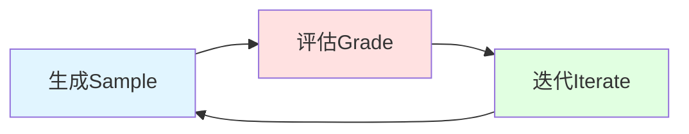
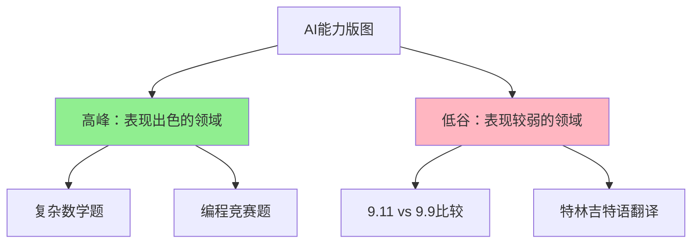
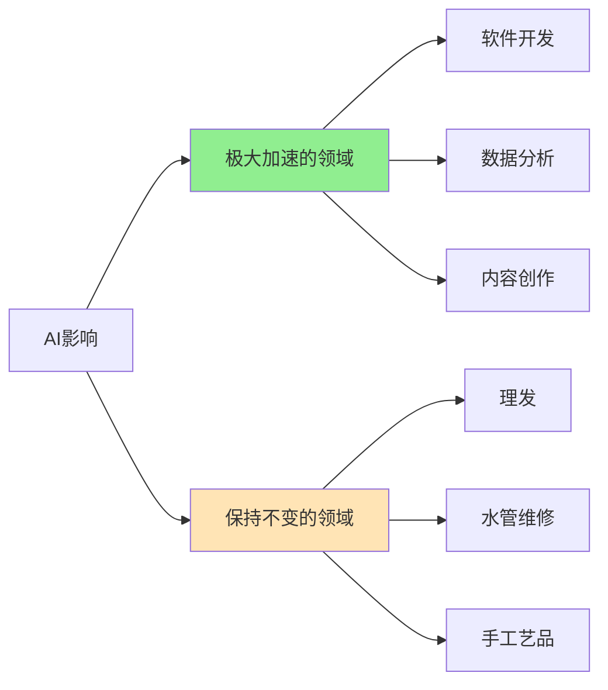
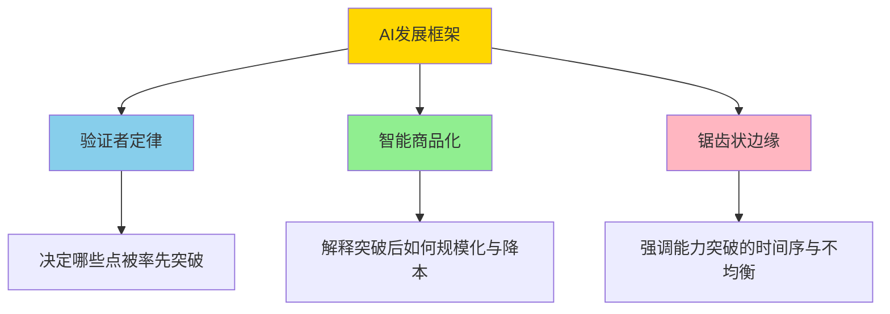

## 前言

> **「所有能被验证的任务，最终都会被 AI 解决。」**
> 
> **「智能未来将成为一种商品，未来获取知识或进行某种推理的成本和可及性将趋近于零。」**

最近，前 OpenAI 核心研究员、CoT（思维链）作者 Jason Wei 在斯坦福大学 AI Club 做了一场精彩的演讲。这也是他加入 Meta 超级智能实验室后少有的公开分享。

Jason Wei 提出了三个理解和驾驭 2025 年 AI 发展至关重要的核心思想：**验证者定律**、**智能的锯齿状边缘**和**智能商品化**。

某种意义上来说：
- **验证者定律**决定「哪些点会被率先突破」
- **智能商品化**解释「突破后如何被规模化与降本」
- **锯齿状边缘**则强调「能力突破的时间序与不均衡版图」

虽然没提创业，但似乎又句句不离创业。

**Jason Wei 背景**：目前在 Meta 超级智能实验室工作。在加入 Meta 之前，是 OpenAI 的核心科学家，参与了 o1 模型和 Deep Research 产品的创建，也是 CoT（Chain of Thought，思维链）的作者之一。

---

## 一、智能商品化：智能和知识会变得又快又便宜

### 1.1 AI发展的两个阶段

首先，我们来谈谈「智能商品化」。我认为，AI 的发展可以分为两个阶段：

**第一阶段：推动前沿**
- AI 还不能很好地完成某项任务
- 研究人员正在努力解锁这项新能力
- 以 MMLU（大规模多任务语言理解）为例，过去五年的表现曲线显示性能逐渐提升

**第二阶段：能力商品化**
- 一旦 AI 掌握了某种能力，它就会被商品化
- 达到特定性能水平所需的成本（以美元计）每年都在下降
- 使用达到特定智能水平的模型成本趋近于零

### 1.2 自适应计算的突破

> **为什么这种趋势会持续下去？**

我的观点是，这是深度学习历史上，**自适应计算（adaptive compute）第一次真正奏效**。

**过去的模式**：
- 无论任务简单还是困难，用于解决特定问题的计算量都是固定的
- 回答「加利福尼亚州的首府是什么」和解决奥数竞赛题使用相同的计算量

**现在的突破**：
- 进入自适应计算时代，可以根据任务调整所使用的计算量
- 如果任务非常简单，可以将计算成本降到最低
- 不再需要持续扩大模型规模

**o1模型的证明**：
- 一年多前发布的 o1 模型是最初突破
- 在测试阶段为解决数学问题投入更多计算资源
- 模型在基准测试上的表现显著提升

### 1.3 信息检索的四个时代

AI 商品化还有另外一个方面是，**获取公共信息的时间会越来越短**。我把信息检索分成了四个时代：

| 时代 | 示例问题 | 所需时间 | 方法 |
|-----|---------|---------|-----|
| **前互联网时代** | 1983年釜山的人口 | 几小时 | 开车去图书馆，翻阅百科全书 |
| **互联网时代** | 同上 | 几分钟 | 搜索引擎，浏览网页 |
| **聊天机器人时代** | 同上 | 即时 | 直接询问ChatGPT |
| **智能Agent时代** | 1983年亚洲最多人口30城市的结婚人数排序 | 几小时→几分钟 | AI自主搜索、分析、整合 |

**复杂查询示例**：
- 问题：「1983 年釜山有多少人结婚」
- GPT-3：无法完成
- **OpenAI Operator**：可以做到
  - 访问韩国统计信息服务（KOSIS）数据库
  - 自主点击查找
  - 找到正确的数据库查询
  - 返回答案

### 1.4 BrowseComp基准测试

为了衡量这种能力，OpenAI 创建了 **BrowseComp 基准测试**：

**特点**：
- 答案容易验证，但找答案非常耗时
- 示例：「找出符合所有这些限制条件的足球比赛」

**人类vs AI表现**：
- 人类：平均需要两个多小时，很多问题在两小时内无法完成
- **OpenAI Deep Research**：可以解决其中大约一半的问题

### 1.5 智能商品化的三大影响

**1. 领域民主化**
> 那些过去因为知识门槛（比如编程）而受限的领域，会变得更加开放。

- **编程**：技术门槛大幅降低
- **个人健康**：过去去医生那里说「我想改善我的鼻呼吸」，医生可能只会说「试试我告诉你的方法」。但现在，ChatGPT 几乎能提供一个好医生能给你的所有信息

**2. 私有信息价值提升**
> 既然公共信息的成本降得这么低，那那些私密的、内部的、不公开的信息，相对价值就会高得多。

- 非市场挂牌出售的房屋信息更值钱
- 内部数据、专有知识的价值凸显

**3. 个性化信息流**
> 你访问的不再是人人共享的公共互联网，而是一个为你量身定制的个性化互联网。

- 获取信息变得无摩擦、毫不费力
- AI会专门为你展示你想知道的内容

---

## 二、验证者定律：训练AI解决任务的能力与任务的可验证性成正比

### 2.1 验证与求解的不对称性

**核心概念**：
> 对于某些任务，验证解决方案比找到解决方案要容易得多。

**典型示例**：

| 任务类型 | 生成难度 | 验证难度 | 不对称性 |
|---------|---------|---------|---------|
| **数独** | 中等 | 容易 | 正向（易验证） |
| **Twitter代码** | 困难（需几千工程师） | 容易（刷网页点几下） | 正向（易验证） |
| **竞赛数学题** | 困难 | 中等 | 平衡 |
| **数据处理脚本** | 简单（自己写） | 困难（理解别人代码） | 反向（难验证） |
| **事实性文章** | 容易（编造听起来有理的事实） | 困难（逐条核实） | 反向（难验证） |
| **饮食方案** | 容易（随口说出） | 困难（需长期实验验证） | 反向（难验证） |

### 2.2 验证者定律的定义

> **验证者定律（Verifiers Law）：训练 AI 解决任务的能力，与该任务的可验证性成正比。**

**推论**：
- 任何**可解决且易于验证**的任务，最终都会被 AI 攻克
- 首先被自动化的任务，将是那些非常容易验证的任务

### 2.3 可验证性的五个维度

具体来说，我认为「可验证性」体现在以下五个方面：

1. **客观性**：有没有明确的对错标准？
2. **验证速度**：检查起来快不快？
3. **可批量验证**：能不能一次性检查几百万个方案？
4. **低噪音**：验证结果是否稳定可靠？
5. **连续反馈**：是只有「对」和「错」两种结果，还是能给出具体的分数，衡量质量的好坏？

### 2.4 特权信息改变任务位置

有意思的是，你可以通过提供一些**特权信息（privileged information）**来改变任务在「生成-验证」图上的位置：

**示例**：
- **竞赛数学**：如果给你提供答案，检查就变得非常容易
- **编程任务**：如果给你测试用例（如 SWE-bench），检查也变得非常容易

> **核心思想**：有些任务你可以预先做一些工作，从而增加验证的不对称性。

### 2.5 AI基准测试的快速攻克

大多数 AI 基准测试，从定义上来说，都是易于验证的。

**历史证明**：
- 过去五年中关注的所有基准测试都相对快速地被 AI 解决
- 这是验证者定律的最好实例

### 2.6 DeepMind AlphaDev的实践

**AlphaDev项目**是利用验证不对称性的绝佳例子：

**任务示例**：
> 「找到这 11 个六边形的放置方式，使得围绕它们绘制的最小外围六边形面积最小。」

**符合五个标准**：
- ✅ 结果客观（画出来就能验证）
- ✅ 验证速度快且可扩展（计算性的，能批量检查）
- ✅ 噪音低（每次检查结果都一样）
- ✅ 连续反馈（外接六边形的大小直接反映方案优劣）

**进化式搜索算法**：

1. **生成（Sample）**：让大语言模型生成大量候选解决方案（代码）
2. **评估（Grade）**：任务高度可验证，自动、快速地给每个方案打分
3. **迭代（Iterate）**：将得分最高的方案作为「灵感」，反馈给大语言模型

**成果**：
- 通过投入海量计算资源进行循环
- 能够发现比人类专家设计的算法更优的解

**聪明之处**：
- 巧妙地避开了「泛化」问题
- 训练和测试是同一个任务
- 只关心解决这一个具体问题
- 需要挑选那些有可能找到比已知答案更好的答案的问题

### 2.7 创业启示

> **未来一个非常重要的领域（无论是你想创业还是看好它会发展），就是发明衡量事物的方法。**

**机会点**：
- 如果你能为某个原本难以衡量的领域（比如创造力、用户体验）设计出一套快速、客观、可扩展的评估体系
- 那么接下来就可以利用 AI 来大规模地优化它

---

## 三、智能的锯齿状边缘：发展不均衡

### 3.1 对AI影响的分歧

> **「AI 的发展会怎么改变我们的世界？」**

你会发现，不同的人会给出完全不同的答案：

**量化交易朋友的看法**：
> 「ChatGPT 确实很酷，但它做不了我工作中那些具体的事情。」

**顶尖实验室AI研究员的看法**：
> 「我们基本上只剩下两到三年的工作时间了，之后 AI 就会取代我们的工作。」

**Boaz的观点**：
> 「东海岸的人低估了即将到来的变革，他们可能会说'哦，当前的模型做不到这个'，而不太考虑其发展轨迹。而在湾区，可能又会低估把我们训练出来的模型真正落地应用，需要克服多少障碍，耗费多少时间。」

**Roon的观点**：
> 「现在不应该给出或接受任何职业建议。所有人普遍低估了变革的广度和规模，还有未来职业生涯的巨大不确定性。」

### 3.2 为什么「快速起飞」不会发生

长期以来，有一个假说叫做**「快速起飞」（fast takeoff）**：

**假说内容**：
- 一旦 AI 在某个方面超越了人类
- 就会突然变得比人类强大得多
- 在很短的时间内，实现智能的爆炸式增长

**我的观点**：这种情景可能不会发生。

**更现实的场景**：

| 时间线 | AI能力状态 |
|-------|-----------|
| **第一年** | AI连研究代码库都跑不起来 |
| **第二年** | AI可以勉强训练一个模型，但效果很差 |
| **第三年** | AI可以自主训练了，但效果不如顶尖的人类研究团队 |
| **第四年** | AI训练得很好，但偶尔还需要人类介入来解决疑难杂症 |

> **这更像是一个自我改进能力的「光谱」，而不是一个二元的选择。**

### 3.3 锯齿状边缘的形成

**核心观点**：
- 自我改进的速度，应该按「每个具体任务」来考量
- 各种任务就像锯齿状的边缘

**高峰示例**（AI表现出色）：
- 复杂的数学题
- 某些编程竞赛题

**低谷示例**（AI表现较弱）：
- ChatGPT 曾经很长时间都说 9.11 比 9.9 大
- 特林吉特语（Tlingit）翻译：只有几百个美洲原住民才会说的语言

> **我并不认为我们会看到这样的情况：一个自我改进的模型，突然之间就什么都搞定了。**

### 3.4 预测AI进步速度的三个窍门

#### 窍门1：AI擅长数字任务

**原因**：
- 核心是**迭代速度**
- 搞数字任务，扩展计算资源比用真实机器人做实验容易多了

**示例**：
- 「家庭作业机器」漫画（1981年）：对AI工作方式的描绘在今天看来还挺准
- 《我，机器人》那种场景：也许很快会有，但目前还没实现

#### 窍门2：对人类来说越容易的任务，AI往往也觉得越容易

**推论**：
- 可以想象一下人类任务难度的分布
- AI可能能完成人类因为生理限制而无法完成的任务
  - 示例：预测乳腺癌（如果能看过1000万张图像）

#### 窍门3：数据越充足，AI就越如鱼得水

**实证**：
- 语言模型在不同语言中的数学表现
- 某个语言的「使用频率」（数据量）和它的表现呈正相关
- **趋势非常明显：数据越多，AI在这个任务上就表现得越好**

**强化学习的补充**：
> 如果存在一个明确的、单一的客观评估指标，那么你就可以采用 AlphaEvolve 或 AlphaZero 的策略，通过强化学习来生成「假数据」，实现自我训练。

**Danny Do的推特**：
> 「只要任务提供清晰的评估指标，可以作为训练时的奖励信号，任何基准测试都可以被迅速解决。」

### 3.5 AI任务时间表预测

| 任务 | 人类难度 | 是否数字任务 | 数据充足度 | 预计时间 |
|-----|---------|------------|-----------|---------|
| **翻译（前50种语言）** | 不难 | ✅ | 充足 | ✅ 已完成 |
| **调试基础代码** | 中等 | ✅ | 充足 | ✅ 2023年 |
| **竞赛数学** | 难 | ✅ | 充足 | ✅ 2024年 |
| **AI研究** | 很难 | ✅ | 中等 | 🔮 2027年？ |
| **化学研究** | 难 | ❌ | 中等 | 🔮 比AI研究晚 |
| **拍电影** | 非常难 | ✅ | 充足 | 🔮 2029年？ |
| **预测股市** | 极难 | ✅ | 充足 | ❓ 不确定 |
| **翻译特林吉特语** | 不难（对懂的人） | ✅ | 极少 | ❌ 可能性极低 |
| **修水管** | 中等 | ❌ | 不确定 | ❓ 不确定 |
| **理发** | 中等 | ❌ | 中等 | ❌ 很难 |
| **手工地毯制作** | 非常难 | ❌ | 极少 | ❌ 短期不可能 |
| **带女朋友约会让她开心** | 😊 | ❌ | 极少 | ❌ 永远搞不定！ |

> **注**：这些年份都是我随口说的，大家别当真。

### 3.6 总结与启示

**核心观点**：
1. 不会出现某种快速的超级智能起飞
2. 每项任务的能力和改进速度都不同
3. AI影响最大的，是那些符合特定属性的任务：
   - ✅ 数字任务
   - ✅ 对人类来说不难
   - ✅ 数据丰富

**影响预测**：

- **某些领域将因 AI 而极大地加速**：例如软件开发
- **另一些领域可能会保持不变**：例如理发

---

## 四、结语与思考

Jason Wei 的三个核心思想为我们理解2025年AI发展提供了一个完整的框架：

### 核心框架总结

### 对创业者的启示

虽然演讲没有直接提到创业，但其中蕴含的洞察对创业者极具价值：

1. **选择易验证的问题域**
   - 优先进入那些可以快速验证结果的领域
   - 投资于建立评估体系

2. **关注成本降低趋势**
   - 智能商品化意味着私有信息的价值提升
   - 专注于获取和利用独特的数据资源

3. **理解不均衡发展**
   - 不要指望AI在所有领域同步突破
   - 在数字任务、数据丰富的领域优先布局
   - 物理世界的服务仍将是人类的优势领域

### 对研究者的启示

1. **关注验证机制设计**
   - 好的验证机制能加速AI在该领域的进步
   - 评估体系的设计本身就是重要的研究课题

2. **重视自适应计算**
   - Test-time compute是重要的研究方向
   - 如何根据任务难度动态调整计算资源

3. **数据效率仍然重要**
   - 长尾任务、小语种、特殊领域的数据仍然稀缺
   - 如何用有限数据达到好效果仍是关键问题

### 最后的思考

Jason Wei 的框架提醒我们：

> **AI的发展不是一场革命，而是一系列不均衡的进化。**

我们不应该期待某个「奇点」时刻的到来，而应该理解：
- 哪些任务会被快速解决（易验证、数字化、数据丰富）
- 哪些能力会被商品化（成本趋近于零）
- 哪些领域仍将保持人类优势（物理世界、低数据领域）

这种务实而精准的视角，或许正是我们在AI时代最需要的。

---

**演讲视频**：[Jason Wei at Stanford AI Club](https://www.youtube.com/watch?v=b6Doq2fz81U)

**编译整理**：Founder Park
