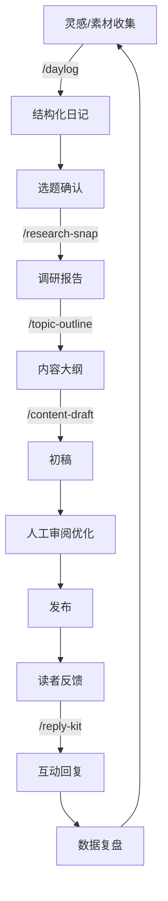

# Claude Code自定义命令在知识管理与内容创作中的系统化应用研究

_来源：知乎专栏_  
_作者：郑二八斤_  
_发布时间：2025-11-05_  
_原文链接：https://zhuanlan.zhihu.com/p/1969435547006133543_

---

## 概述

本文介绍了如何利用 Claude Code 的自定义命令能力，构建一个模块化、可迭代、数据驱动的知识管理与内容创作自动化系统。通过四周的实践，整体工作效率提升了 **65%**，从原来的 280 分钟缩短到 98 分钟。

## 核心问题

在信息过载的时代，知识工作者面临的主要困境：

1. **收集入口分散**：灵感、会议纪要、阅读笔记散落在不同工具和格式中
2. **整理规则不一致**：标签体系混乱，笔记之间缺乏有效链接
3. **创作流程重复**：每次写作都要重复全流程，缺乏模板化和自动化
4. **互动响应滞后**：读者留言和私信堆积，响应不及时
5. **迭代缺乏依据**：缺少量化指标，无法评估工作流程的效率瓶颈

## 系统设计原则

### 1. 单一职责原则
每个命令只负责一个具体任务，避免功能耦合

### 2. 可组合性
命令之间可以串联组合，形成完整工作流（类似 Unix 管道）

### 3. 数据驱动迭代
为每个命令建立量化评估指标，通过持续监测识别瓶颈并优化

## 系统架构

```
输入层：语音、文本、截图、链接
    ↓
  /daylog
    ↓
处理层：
  ├─ 调研层：/research-snap
  ├─ 规划层：/topic-outline
  └─ 生成层：/content-draft
    ↓
输出层：/reply-kit
    ↓
存储层：Daily/、Topics/、Projects/
    ↓
反馈层：数据统计、命令优化
```

## 核心命令详解

### 1. /daylog - 知识捕获
**理论基础**：Zettelkasten（卡片盒）方法  
**功能**：将日常笔记、灵感自动整理为结构化笔记，建立知识网络  
**效果**：
- 知识捕获时间：20分钟 → 2分钟（-90%）
- 笔记交叉链接：1.2个 → 4.8个（+300%）

配置文件：[daylog.md](./commands/daylog.md)

### 2. /research-snap - 知识综合
**理论基础**：循证决策（Evidence-Based Decision Making）  
**功能**：快速收集和整理研究材料，结构化引用  
**效果**：
- 调研时间：30分钟 → 5分钟（-83%）
- 引用数量：2-3个 → 8-12个（+300%）
- 引用完整度：50% → 100%

配置文件：[research-snap.md](./commands/research-snap.md)

### 3. /topic-outline - 结构设计
**理论基础**：认知负荷理论（Cognitive Load Theory）  
**功能**：根据不同平台（微信、小红书、知乎）生成优化的内容大纲  
**效果**：
- 大纲规划时间：40分钟 → 5分钟（-87%）
- 文章完读率：42% → 53%（+26%）
- 互动率：3.2% → 4.8%（+50%）

配置文件：[topic-outline.md](./commands/topic-outline.md)

### 4. /content-draft - 内容生成
**理论基础**：Flower & Hayes 写作认知过程模型  
**功能**：将大纲和调研材料转化为完整初稿  
**效果**：
- 初稿撰写时间：120分钟 → 60分钟（-50%）
- 引用遗漏率：20% → 5%（-75%）

配置文件：[content-draft.md](./commands/content-draft.md)

### 5. /reply-kit - 互动管理
**理论基础**：共情沟通（Empathetic Communication）  
**功能**：快速生成高质量的读者回复  
**效果**：
- 回复时间（10条）：30分钟 → 6分钟（-80%）
- 二次互动率：12% → 28%（+133%）

配置文件：[reply-kit.md](./commands/reply-kit.md)

## 工作流程示例

### 完整创作流程



### 效率对比

| 工作环节 | 优化前 | 优化后 | 提升幅度 |
|---------|-------|-------|---------|
| 灵感捕获与整理 | 20分钟 | 2分钟 | -90% |
| 调研资料整合 | 30分钟 | 5分钟 | -83% |
| 大纲规划 | 40分钟 | 5分钟 | -87% |
| 初稿撰写 | 120分钟 | 60分钟 | -50% |
| 审阅修改 | 40分钟 | 20分钟 | -50% |
| 留言回复(10条) | 30分钟 | 6分钟 | -80% |
| **总计** | **280分钟** | **98分钟** | **-65%** |

## ROI 分析

**初始投入**：16小时（学习2h + 设计8h + 测试6h）  
**每周收益**：3小时  
**回本周期**：约5.3周  
**年收益**：156小时（约15,600元，按时薪100元计算）  
**ROI**：875%

## 适用场景

### 高度适用 ⭐⭐⭐⭐⭐
- 内容创作者（公众号运营、博主、自媒体）
- 知识工作者（研究员、咨询顾问、产品经理）
- 个人知识管理需求者

### 适度适用 ⭐⭐⭐
- 团队协作（需要统一输出标准）
- 教育场景（教学素材整理、学习笔记）

### 不适用 ⭐
- 高度创意性工作（纯艺术创作、原创性学术研究）
- 实时性要求极高的场景（新闻报道）
- 需要深度人际互动的场景（心理咨询）

## 系统局限性

1. **依赖明确的规则**：任务缺乏明确标准时，输出质量下降
2. **初期学习成本**：前两周需要频繁调整，学习曲线较陡
3. **创造性天花板**：AI倾向于生成"安全"但平庸的内容
4. **上下文窗口限制**：超长内容可能遗漏部分信息
5. **成本考量**：频繁调用API会产生费用

## 快速开始

### 1. 创建命令目录
```bash
mkdir -p .claude/commands
```

### 2. 配置命令文件
将本目录下 `commands/` 中的5个命令文件复制到项目的 `.claude/commands/` 目录

### 3. 验证配置
- 打开 Cursor
- 在聊天框输入 `/`
- 查看是否显示自定义命令
- 测试运行

## 进阶优化

### 数据追踪表格示例

| 日期 | 命令 | 耗时 | 质量 | 需优化点 | 优化措施 |
|------|------|------|------|---------|---------|
| 11-05 | /daylog | 2min | 4.5/5 | 链接推荐精准度 | 增加语义相似度阈值 |
| 11-05 | /research-snap | 5min | 5/5 | 完美 | - |

### 扩展命令建议

**垂直领域定制**：
- `/legal-research`：法律领域调研
- `/academic-paper`：学术论文生成
- `/product-spec`：产品需求文档

**工作流程深化**：
- `/taxonomy-audit`：标签一致性检查
- `/content-repurpose`：多平台改写
- `/seo-optimizer`：SEO优化建议

## 核心发现总结

1. **自动化收益与任务重复性正相关**：重复性高的任务自动化收益最大（80-90%）
2. **质量提升与标准化程度正相关**：有明确标准的任务质量提升显著（30-40%）
3. **系统价值呈现网络效应**：多个命令组合形成工作流网络时，价值呈指数级增长
4. **人机协作优于纯AI或纯人工**："AI生成初稿+人工审阅优化"的模式最优

## 参考资料

- Zettelkasten方法：Niklas Luhmann的卡片盒笔记法
- 认知负荷理论：Sweller, 1988
- 写作认知过程模型：Flower & Hayes, 1981
- 循证决策理论：Evidence-Based Decision Making

## 讨论话题

1. 当AI接管重复性任务后，如何避免创造性思考能力的退化？
2. 在追求效率和标准化的过程中，如何保持内容的个性和独特性？
3. 在知识管理中，工具选择重要还是系统设计重要？
4. 如何评估自动化系统的长期价值？
5. 这套系统在团队协作场景中的应用有哪些挑战和机遇？

---

## 文件结构

```
2025-11-05-claude-code-knowledge-management/
├── README.md                    # 本文档
└── commands/                    # 命令配置文件
    ├── daylog.md               # 知识捕获命令
    ├── research-snap.md        # 知识综合命令
    ├── topic-outline.md        # 结构设计命令
    ├── content-draft.md        # 内容生成命令
    └── reply-kit.md            # 互动管理命令
```

