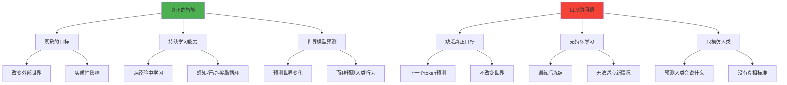

## 前言

Dwarkesh Patel 最新播客迎来了重量级嘉宾：强化学习创始人之一、2024 年图灵奖得主 Richard Sutton。这场对话火药味十足，Sutton 直言不讳地批评了当前 LLM 的发展方向，认为它们根本没有真正的智能，甚至违背了他在 2019 年提出的著名「苦涩教训」（The Bitter Lesson）原则。

作为强化学习的奠基者，Sutton 的观点引发了 AI 社区的激烈讨论。他认为真正的智能必须具备持续学习能力，而 LLM 只是在模仿人类，缺乏真正的目标和世界理解。

---

## 一、核心分歧：LLM 到底算不算智能？

### 1.1 Sutton 的智能定义

Sutton 的观点犀利且明确：**LLM 只是在模仿人类，而不是真正理解世界。**

他认为真正的智能必须具备几个关键要素：
- **有明确的目标**：能够追求具体的、可衡量的目标
- **能从经验中学习**：通过与环境交互获得新知识
- **能预测世界的变化**：理解行动的后果

### 1.2 LLM 的根本缺陷

**预测目标的错位：**
> 它们只是在预测「人会说什么」，而不是预测「世界会发生什么」。

**缺乏真正的目标：**
> 「LLM 没有目标，」Sutton 强调，「预测下一个 token 不是真正的目标，因为它不会改变世界。」

在他看来，没有目标就没有智能可言——这就像一个只会鹦鹉学舌的系统，看起来很聪明，实际上并不理解自己在说什么。

### 1.3 持续学习能力的缺失

**致命的局限：**
更为致命的是，LLM 缺乏持续学习能力。它们在训练阶段学习，然后就被冻结了。即使在对话中遇到了意料之外的回应，它们也不会因此而改变或学习。

这与真正的智能体，无论是人类还是动物，都形成了鲜明对比。

## 二、体验时代 vs 模仿时代

### 2.1 体验时代的愿景

Sutton 提出了一个重要概念：**体验时代（Era of Experience）**。

**真正AI的学习方式：**
在他的设想中，真正的 AI 应该像所有动物一样，通过「**感知-行动-奖励**」的循环来学习。这个循环不断重复，构成了生命和智能的基础。智能体通过改变行动来增加奖励，这才是真正的学习。

### 2.2 模仿学习的根本问题

**LLM 的错误路径：**
而 LLM 走的是完全不同的路：它们学习的是「给定情境，人类会怎么做」。

**缺乏真相标准：**
这种模仿学习有个根本问题：**没有真相（ground truth）**。

- **强化学习**：可以通过实际结果来验证预测是否正确
- **LLM 学习**：没有「正确答案」的定义，只有「人类通常会说什么」

### 2.3 对人类学习方式的重新思考

**质疑模仿学习假设：**
Sutton 甚至质疑了「人类通过模仿学习」这个普遍观点。

**婴儿学习的真相：**
> 他认为，婴儿挥舞双手、转动眼睛，这些动作没有人教，也没有模仿的对象。即使是语言学习，孩子也是在尝试发音、观察结果，而不是单纯地复制大人的话。

## 三、LLM 不符合「苦涩教训」

### 3.1 讽刺的历史转折

**意外的反转：**
这里的讽刺意味十足。Sutton 在 2019 年写下的「苦涩教训」成了 AI 界最有影响力的文章之一，许多人用它来为 LLM 的大规模扩展辩护。

**作者的不同观点：**
但 Sutton 本人却认为：**LLM 恰恰违背了这个原则。**

### 3.2 苦涩教训的核心原理

**核心观点：**
> 苦涩教训的核心是：依赖计算的通用方法最终会胜过依赖人类知识的方法。

**LLM 的悖论：**
但 LLM 呢？它们本质上是在利用海量的人类知识：整个互联网的文本。当这些数据耗尽后，它们就会被那些能从经验中学习的系统所超越。

### 3.3 历史规律的重现

**Sutton 的预言：**
> 「这就像历史上每一次一样，」Sutton 说，「依赖人类知识的方法一开始看起来很好，但最终会被更通用、更可扩展的方法击败。」

## 四、社区激烈交锋

这场对话在 AI 社区引发了激烈讨论，各方观点针锋相对。

### 4.1 调和派观点

**Built2Think(@Built2T)** 试图调和两种观点：
> 自回归 LLM 和 RL 都处理序列或时间序列数据，这是一个基本认识——观察和行动都发生在时间中。LLM 提示设置了类似意图的心理状态，但它们的输出并没有以明显的方式用于满足目标。

### 4.2 质疑派声音

**Jacob Beck(@jakeABeck)** 分享了 Sutton 在 RL 会议上的演讲照片，并提出质疑：
> 难道 LLM 不是已经在做所有这些事情了吗？

他展示了 Sutton 关于持续学习挑战的观点：
```
OaK requires reliable continual learning.
Can we do this yet? We have needed it for 40 years.
We can do it for one-layer (linear) networks.
But Conventional deep learning fails catastrophically.
    Catastrophic forgetting (French 199 and many others)
    Catastrophic loss of plasticity (Dohare et al 2024 and others)
Dohare's Continual Backprop is one of several recent solutions.
Meta-learning of new features may also help.
```

### 4.3 批评派反击

**Gary Marcus(@GaryMarcus)** 表达不满：
> Sutton 对 LLM 的批评几乎与我多年来一直在争论的观点完全相同。令人失望的是，@dwarkesh_sp 你不让我展示我的观点。

**Crucible(@LokiOfKnight)** 最尖锐的批评：
> 当他说人类不通过模仿学习时，我感到尴尬。他有一个有缺陷的观点，所以很难认真对待他说的任何话。

**Kristoph(@ikristoph)** 直接反驳：
> 恕我直言，@RichardSSutton 的一些陈述是荒谬的。整个人类教育系统都基于模仿标准。你基本上不是因为学到了什么而被评分，而是因为你能否模仿「训练」。

### 4.4 实用派观点

**Tyler Moore(@TylerMo41608321)** 认为不需要持续学习：
> 增加上下文加上记忆基本上就能完成这项工作。

**Nick Savage(@impossibilium)** 提出有趣观察：
> 我不太确定 LLM 没有目标这个论点。也许我们只是不理解它们是什么？对 ASI 来说，通过性追求快乐可能感觉毫无意义，就像下一个 token 预测对我们的感觉一样。

> 从经验上看，监督学习显然会发生。如果我在晚饭前偷偷吃饼干，我保证我的儿子会通过模仿学习到这是可以接受的。

### 4.5 核心分歧的本质

这场对话揭示了 AI 发展中的根本分歧：
- **继续沿着模仿人类的道路前进？**
- **还是转向真正的经验学习？**

**Sutton 的答案很明确：只有后者才能通向真正的智能。**

## 五、完整对话精华：深度剖析智能的本质

### 5.1 关于人类与动物的本质

**Dwarkesh**：我们试图复制智能，对吧？没有动物能登月或制造半导体，所以我们想了解是什么让人类特殊。

**Sutton**：
> 为什么你要区分人类？人类就是动物。我们的共同点更有趣。我们应该少关注区分我们的东西。

> 我喜欢你认为这是显而易见的方式。因为我认为相反的是显而易见的。我认为我们需要理解我们是如何成为动物的。如果我们理解了松鼠，我认为我们就几乎到达了那里。理解人类智能。语言部分只是表面的一小层装饰。

### 5.2 关于强化学习与大语言模型的本质差异

**Dwarkesh**：从概念上讲，从 RL 的角度思考 AI，我们缺少了什么？

**Sutton**：
> 强化学习是基础 AI，什么是智能或问题是理解你的世界。强化学习是关于理解你的世界，而大语言模型是关于模仿人们，做人们说你应该做的事，它们不是关于弄清楚该做什么。

**Dwarkesh**：要模拟互联网文本语料库中的万亿个 token，你必须建立一个世界模型。事实上，这些模型似乎确实有非常强大的世界模型。

**Sutton**：
> 我不同意你刚才说的大部分内容。仅仅模仿人们说的话根本不是建立世界模型。世界模型能让你预测会发生什么。它们有能力预测一个人会说什么。它们没有能力预测会发生什么。

> 我们想要的，引用 Alan Turing 的话，我们想要的是一台能从经验中学习的机器。经验是你生活中实际发生的事情。你做事，你看到会发生什么。这就是你学习的东西。

### 5.3 关于目标与智能的本质

**Dwarkesh**：但这不就是下一个 token 预测吗？预测下一个是什么，然后根据惊讶进行更新？

**Sutton**：
> 下一个 token 是它们应该说什么。这个动作应该是什么。这不是世界会给它们什么作为它们所做的回应。

> 让我们回到它们缺乏目标。对我来说，拥有目标是智能的本质。如果某物能实现目标，它就是智能的。我喜欢 John McCarthy 的定义，智能是实现目标能力的计算部分。所以你必须有目标。否则你只是一个行为系统。

**Dwarkesh**：我认为它们有目标——下一个 token 预测。

**Sutton**：
> 那不是目标。它不会改变世界。Token 向你袭来。如果你预测它们，你不会影响它们。这不是关于外部世界的目标。这不是实质性目标。你不能看着一个系统说，哦，它有目标，如果它只是坐在那里预测并对自己准确预测感到满意。

### 5.4 关于苦涩教训的讨论

**Dwarkesh**：你在 2019 年写了题为《苦涩教训》的文章。这可能是 AI 历史上最有影响力的文章，但人们用它作为扩展 LLM 的理由。所以有趣的是，你的观点是 LLM 实际上不符合苦涩教训。

**Sutton**：
> 大语言模型是否是苦涩教训的案例是一个有趣的问题。因为它们显然是使用大规模计算的一种方式。可扩展到互联网的极限。但它们也是投入大量人类知识的一种方式。

> 在苦涩教训的每个案例中，你都可以从人类知识开始。然后做可扩展的事情。这总是可能的。但实际上，它总是被证明是糟糕的。因为人们被锁定在人类知识方法中。

### 5.5 关于未来AI发展方向的思考

**Dwarkesh**：给我一个可扩展方法的感觉。

**Sutton**：
> 可扩展的方法是你从经验中学习。你尝试事物。你看到什么有效。没有人必须告诉你，首先，你有一个目标。所以没有目标，就没有对错或更好更坏的感觉。

> 大语言模型试图在没有目标或更好或更坏的感觉的情况下过关。这就是从错误的地方开始。

---

## 六、核心观点总结

### 6.1 Sutton 的智能理论框架



### 6.2 体验时代 vs 模仿时代

| 维度 | 体验时代（Sutton推崇） | 模仿时代（LLM现状） |
|------|----------------------|-------------------|
| **学习方式** | 感知-行动-奖励循环 | 预测人类文本 |
| **目标性质** | 改变外部世界的实质目标 | 预测下一个token |
| **验证标准** | 实际结果反馈 | 无客观真相标准 |
| **持续性** | 持续从经验学习 | 训练后冻结 |
| **泛化能力** | 跨环境泛化 | 局限于训练分布 |

### 6.3 对"苦涩教训"的重新解读

**传统理解**：大规模计算胜过人工设计
**Sutton的观点**：LLM违背了苦涩教训，因为它们本质上依赖海量人类知识

**历史规律**：
1. 依赖人类知识的方法初期表现良好
2. 但最终被通用、可扩展的方法超越
3. LLM将被真正从经验学习的系统替代

## 七、深度思考与启示

### 7.1 对AI发展路径的反思

Sutton的观点提醒我们思考几个根本问题：

1. **什么是真正的智能？** 是模仿人类行为，还是具备独立的目标和学习能力？

2. **AI的发展方向是否正确？** 当前的LLM路径是否会遇到根本性瓶颈？

3. **如何实现真正的通用智能？** 需要什么样的架构和训练范式？

### 7.2 对研究者和从业者的启示

**对研究方向的思考**：
- 重新审视强化学习在AGI中的核心地位
- 探索真正的持续学习机制
- 设计具备实质性目标的AI系统

**对产业发展的警示**：
- LLM可能不是通向AGI的最终路径
- 需要为范式转换做好准备
- 投资真正的经验学习系统研究

## 结语

Richard Sutton作为强化学习的奠基者，他对LLM的批评不是简单的技术路线之争，而是对智能本质的深度思考。他提醒我们：

> **真正的智能不是模仿，而是理解；不是预测人类会说什么，而是预测世界会发生什么；不是被动接受训练，而是主动从经验中学习。**

无论我们是否完全认同Sutton的观点，这场讨论都为AI的未来发展提供了重要的思考维度。在LLM大行其道的今天，保持对不同技术路径的开放态度，或许正是推动AI真正进步的关键所在。

---

*本文整理自Dwarkesh Patel与Richard Sutton的播客对话，旨在为中文读者提供这位图灵奖得主对当前AI发展的深度思考。*